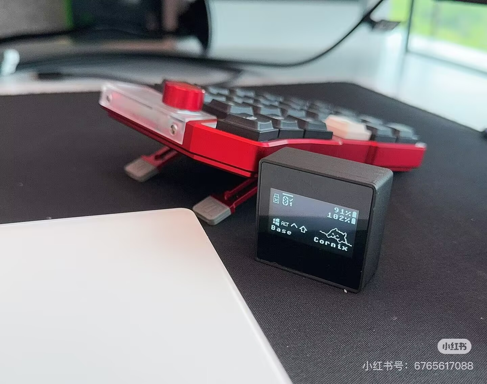
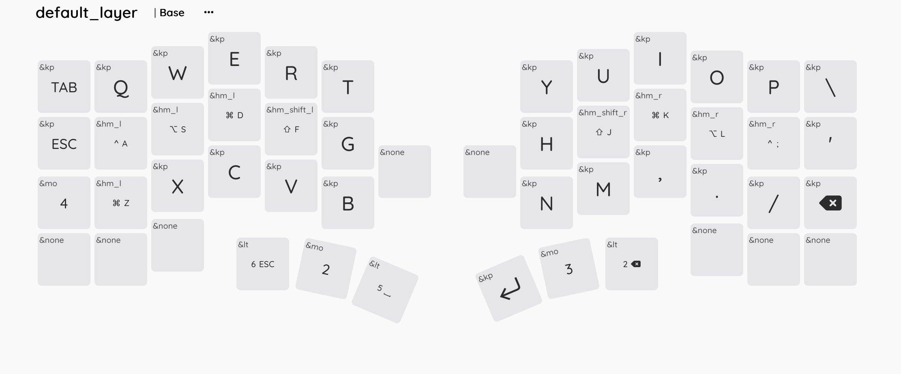

# cornix-oyayubi — NICOLA thumb-shift for the Cornix keyboard (ZMK)

日本語の**親指シフト(NICOLA)**入力を、分割キーボード **Cornix** の ZMK ファームウェアだけで実現します。
OS 側の特別なソフトは不要（かな変換は各OSの標準IMEを使います）。Windows / macOS 両対応。

Bring **NICOLA thumb-shift** Japanese input to the **Cornix** split keyboard, entirely in ZMK
firmware — no host-side software needed (kana conversion uses your OS's built-in IME).
Works on Windows and macOS.

## Quick start / はじめかた

**必要なもの**: Cornix 本体（左右）/ USB-C ケーブル / Chrome または Edge（設定変更時のみ）

判定方式・親指キー・キー配列は**あとからブラウザだけでいくらでも変えられる**ので、
まずは何も変更せず、ビルド済みファームをそのまま焼いて動かすのがおすすめです。
fork やビルド環境の構築は不要です（fork が必要になるケースは[後述](#fork-が必要になるのはいつ)）。

### ステップ1: ファームウェア(UF2)をダウンロードする

以下の2ファイルをダウンロードするだけです（GitHub ログイン不要・zip 展開不要）:

- **左手用**: [cornix_left_default_nosd.uf2](../../releases/latest/download/cornix_left_default_nosd.uf2)
- **右手用**: [cornix_right_nosd.uf2](../../releases/latest/download/cornix_right_nosd.uf2)

（main が更新されるたびに CI が **[Releases](../../releases/latest)** を自動更新します。Releases には
他構成用の `.uf2`（`dongle` / `debug` / `reset` 入りの名前）も並んでいますが、通常（ドングルなし）構成で
使うのは上記2つだけです）

### ステップ2: キーボードに書き込む（左右それぞれ・初回のみ）

> **⚠️ 書き込み前のバックアップ（推奨）**: 書き込むと純正ファームは消えます。
> 手順2でドライブが現れたら、新しい UF2 を入れる**前に**、ドライブ内の `CURRENT.UF2` を
> PC にコピーして保存してください（左右それぞれ。`left`/`right` が分かる名前に変えておくと安心）。
> これが「いま入っているファームの吸い出し」で、**元に戻したくなったら同じ手順でこのファイルを
> ドラッグ&ドロップするだけで完全復元**できます。純正ファームは公式配布ページからも入手できますが、
> 配布終了した版はこの方法でしか戻せません（[firmware/stock/README.md](firmware/stock/README.md) 参照）。

1. **左手側**を USB ケーブルで PC に接続する
2. 本体のリセットボタンを**素早く2回**押す → PC に USB ドライブが現れる（ブートローダモード）
3. そのドライブに `cornix_left_default_nosd.uf2` を**ドラッグ&ドロップ**する
4. コピーが終わるとドライブが自動的に消えて再起動する。これで左手は完了
5. **右手側**も同様に: USB 接続 → リセット2回押し → `cornix_right_nosd.uf2` をドラッグ&ドロップ

書き込みツールのインストールは不要です（UF2 方式なので Windows/macOS 共通・ドラッグ&ドロップのみ）。
うまくいかない場合は [docs/guides/build-and-flash-workflow.md](docs/guides/build-and-flash-workflow.md) 参照。

### ステップ3: 接続して OS 側の IME を準備する

1. 書き込み後は普通のキーボードとして動きます。**無線で使う場合**は OS の Bluetooth 設定からペアリング
   （左手側が親機。以後 USB ケーブルは不要）。USB 接続のままでも使えます
2. OS の IME を**ローマ字入力モード**にする（NICOLA エンジンがローマ字列を送出するため）。
   詳細は [docs/guides](docs/guides/) 参照
3. 半角/全角キーで IME オン →「親」キーで NICOLA レイヤーに入ると親指シフトで打てます

### ステップ4（任意）: 打鍵感を自分に合わせる — 再ビルド・再フラッシュ不要

キーボードを USB で繋ぎ、Chrome/Edge で **https://autofor.github.io/cornix-oyayubi/** を開くと、
その場で変更・保存できます（保存はキーボード内フラッシュ。以後は無線運用でも保持されます）:

- **判定方式** mode（0 = 固定ms窓・先判定 / 1 = やまぶきR風%・後判定）
- **判定窓** timeout(ms) / **判定範囲** range(%) / **連続シフト** cont
- **親指キー単独タップの送出キー** lthumb / rthumb
- 設定の**エクスポート/インポート**（買い替え・複数台への引き継ぎ用）

キー配列そのもの（どのキーに何を割り当てるか・レイヤー構成）も、同じく USB 接続だけで
**[ZMK Studio](https://zmk.studio/)**（ブラウザで開いてキーをクリックで編集）から変更・保存できます
（再ビルド不要。[使い方ドキュメント](https://zmk.dev/docs/features/studio)）。
ZMK Studio は分割キーボードの「central」側のみ対応のため、繋ぐ先は構成で変わります:

- **ドングルなし構成**: 左手（`cornix_left`）を USB 接続
- **ドングルあり構成**: ドングル本体（`cornix_dongle_adapter`）を USB 接続
- （右手/ドングル用左手は peripheral のため接続対象外）

### fork が必要になるのはいつ?

ここまでの手順に fork は不要です。**コンパイル時にしか変えられない設定**を変更したい場合のみ、
自分のアカウントに fork してビルドします。代表例:

- **IME 切替キーの変更**（Windows JIS 配列以外の環境）: 既定では半角/全角キー位置が `GRAVE` を送ります。
  US 配列や macOS では `config/cornix.keymap` の `#define NICOLA_ZENKAKU_KEY GRAVE` を
  自分の環境の IME 切替キーに差し替えてください
- 既定値そのものの変更や、キーマップをテキストで管理したい場合

fork してビルドする手順:

1. このページ右上の **Fork** → **Create fork**
2. **fork 直後は GitHub Actions が無効です。** 自分の fork の **Actions** タブを開き、
   「I understand my workflows, go ahead and enable them」を押して有効化する
   （**これを忘れるとビルドが一切走りません**）
3. fork 内の `config/cornix.keymap` を開き、鉛筆アイコン（Edit）で冒頭の `#define` を編集 → **Commit changes**
4. コミットすると自動でビルドが始まり、完了すると**自分の fork の Releases** に UF2 が並びます。
   以降はステップ1〜2と同じ（ダウンロード元を自分の fork の Releases に読み替え）

## Configure / 設定

コンパイル時の個人設定は `config/cornix.keymap` 冒頭の `#define` に集約しています
（判定窓・判定範囲の既定値、親指シフトキー位置、IME 切替キー `NICOLA_ZENKAKU_KEY` など。
各行のコメント参照）。ランタイムで変えられる項目は上記ステップ4の Web 設定ツールが優先されます。

## Build & flash / ビルドと書き込み（初回のみ）

- **ファームは UF2** なので OS 非依存。キーボードをブートローダ（リセット2回押し）にして、
  現れた USB ドライブに UF2 をドラッグ&ドロップすれば焼けます（Windows/macOS共通、CLIツール不要）。
  これだけで初回セットアップは完了します。
- 毎回GitHub Actionsのページから手動ダウンロードするのが面倒な場合のみ、任意のショートカットとして
  以下のスクリプトが使えます（どちらも `gh` CLI のインストール・ログインが必要）:
  - **Windows**: `tools/flash-cornix.ps1`（最新CIビルドを取得して自動書き込み）
  - **macOS / Linux**: `tools/flash-cornix.sh`（同等）

## Repo layout / 構成

| ディレクトリ | 内容 |
|---|---|
| `config/` | キーマップ・ビルド設定（**まずここを編集**） |
| `modules/nicola/` | NICOLA 同時打鍵エンジン（ZMKモジュール, GPL-2.0-or-later） |
| `boards/` | Cornix のボード/シールド定義 |
| `tools/` | flash・設定・分析ツール |
| `docs/` | ガイド・参考資料・設計記録 |

ライセンスと帰属は [ATTRIBUTION.md](ATTRIBUTION.md)（結合ファームは GPL-3.0-or-later）。

---

## 開発メモ（このプロジェクトの経緯）

Cornix で親指シフト入力を実現するプロジェクトのモノレポ。以前は3リポジトリに分かれていたが2026-07-10に統合した。

| ディレクトリ | 内容 | 旧リポジトリ |
|---|---|---|
| `boards/` `config/` `build.yaml` | キーボード定義・キーマップ・ビルド設定 | zmk-keyboard-cornix (oyayubiブランチ) |
| `modules/nicola/` | NICOLA同時打鍵エンジン (ZMKモジュール) | zmk-nicola |
| `docs/` `tools/` `firmware/` | 設計記録・Web設定ツール・書き込みスクリプト | cornix-oyayubi (元から) |

- Web設定ツール: https://autofor.github.io/cornix-oyayubi/ （GitHub Pages, `docs/index.html`）
- 書き込み: `tools/flash-cornix.ps1`（GitHub Actions の最新ビルドを取得して UF2 書き込み）
- 上流キーボード定義の取り込み: `git remote add upstream https://github.com/hitsmaxft/zmk-keyboard-cornix && git fetch upstream && git merge upstream/main`

以下は上流由来のキーボード説明。

# ZMK Keyboard for Cornix

## Introduction to Boards and Shields

This repository contains the ZMK firmware configuration for the Cornix split keyboard. Below is an explanation of the different boards and shields available in this project:

### Boards

The project includes three main board definitions:

- **`cornix_left`**: The left half of the Cornix split keyboard, used when building firmware without a dongle configuration.
- **`cornix_right`**: The right half of the Cornix split keyboard, used for the slave side in split keyboard setup.
- **`cornix_ph_left`**: Alternative left half board configuration, specifically designed for use with a dongle setup.

### Shields

The project includes several specialized shields that provide additional functionality:

- **`cornix_dongle_adapter`**: Provides common functionality for the matrix and Bluetooth functionality for dongle configurations. This shield is required when using the Cornix with a custom dongle.
- **`cornix_dongle_eyelash`**: An example shield for setting up display device for the dongle board. This is used when the board doesn't already have `zephyr,display` in the device tree.
- **`cornix_indicator`**: A shield that enables RGB LED indicators for battery status and connection status. Note that using this shield consumes more power.

---

This community firmware has been tested with Cornix using ZMK and provides full split-role configuration, battery power management, and Bluetooth central/peripheral setup per ZMK split guidelines





## warning：device breakdown recovery

the original cornix use flash layout without softdevice
so in the project. all board use nosd layout as default 

if you flash firmware into dongle and found it can't work with the original  firmware 
you have two solutions 

1. （recommend）flash the sd restore uf2 under boooader direcotry（its for nice nano 2 ，but i think it works for most of nrf52840 device） other boards https://github.com/hitsmaxft/Adafruit_nRF52_Bootloader/actions/runs/18398554358
2. build your firmware  with snippet  'nrf
52840-nosd', make zmk ignore soft device 


## TODO LIST

- [x] 52 keys full layout keymap, since v2.0
- [x] ec11 encoder, since v2.2
- [x] no-SD image, since v2.3
- [x] support various of dongles
- [x] upgrade to zephyr4.1 and lvgl9 , since v2.7, no dongle screen support yet
- [ ] rgb since in future v3


### about RGB

Cornix shield has 2 RGB LEDs on each side, controled by PWM in the stock firmware.

The replacement solution is adapting the RGB indicator module to light up these RGBs, to achieve the same effect as the stock firmware, which uses the RGB LEDs to indicate battery status and connection status.

But it is not supported yet in this repository.  PR is welcome!

## Supported Hardware: Cornix Split Keyboard

Cornix Split Tented Low‑Profile Ergo Keyboard (Jezail Funder)

Cornix is a Corne‑inspired split ergonomic keyboard featuring a compact 3×6 column‑staggered layout with six thumb‑cluster keys (three per half). It offers adjustable tenting angles at 10°, 18°, and 25°, allowing users to reduce wrist strain and find a custom ergonomic alignment

- **Split, column‑staggered layout** (3×6 + thumb cluster layout).
- **Adjustable tenting support** at 10°, 18°, 25° (hardware‑based, no firmware hacks).
- **Kailh Choc V2 hot‑swap sockets** and support for LAK or LCK low‑profile keycaps.
- **Dual‑mode connectivity**: Wired USB‑C or Bluetooth wireless (left half as master).
- **Firmware**: Fully VIAL‑supported for keymaps and layer customization, stock firmware is RMK.
- Premium **CNC‑machined aluminum chassis**, custom damping foam, and portable storage pouch.

> this project owner is RMK contributor too, support RMK https://rmk.rs/ please

## --Bootloader Recovery Instructions--

-- The original RMK firmware removed the SoftDevice, so before flashing `zmk.uf2`, you need to restore the SoftDevice first. For specific steps, please refer to [bootloader/README.md](./bootloader/README.md). --

Since v2.3 this board' flash partitions has updated, removed SD (reducing sd partitionsize size from 150K to 4K), so You can flash firmware directly.

> You may need to reset fw by reset.uf2 from ealier version

> You can rollback to stock firmware by flash orgin uf2 file, backup files under rmkfw/

## 🔰 Easy Method: Clone This Repository and Build with GitHub Actions

If you're new to ZMK and don't want to deal with `west.yml` or module management, you can simply use this repository directly to customize your firmware.

### Steps

1. **Fork or Clone This Repository**
   - Click **Fork** in the top right to copy this repo to your GitHub account, or
   - Run `git clone` locally.

   > Forking is recommended, because GitHub Actions will automatically build your firmware.

2. **Edit Your Keymap**
   - Locate the keymap file in `config/cornix.keymap` (or whichever `.keymap` file you want to customize).
   - You can edit it directly or use the [ZMK Keymap Editor](https://nickcoutsos.github.io/keymap-editor/):
     - Open the editor and load your `.keymap` file.
     - Make changes with the visual editor.
     - Download the updated file and replace it in your repository.
     - Commit and push the changes to GitHub.

3. **Build with GitHub Actions**
   - After pushing, GitHub Actions will automatically run the build.
   - Once the workflow finishes, go to **Actions → your latest run → Artifacts** and download the firmware (`.uf2`) files.

4. **Flash Your Keyboard**
   - Put your board into UF2 bootloader mode (usually by double-tapping the reset button).
   - Drag and drop the `.uf2` file onto the mounted drive.

### Who Is This For?

- Beginners to ZMK
- Users who only want to customize keymaps
- Anyone who doesn't need to modify drivers or hardware definitions

## How to build Cornix Zmk firmware from scratch

This section will guide you through building the Cornix ZMK firmware from scratch using the official ZMK firmware development process.


### Prerequisites

Before starting, ensure you have the following:
- A GitHub account
 Git installed on your system
- Basic understanding of Git and GitHub
- Your Cornix keyboard PCBs ready

### Step 1: Initialize ZMK Config Repository

1. **Create a new repository** using the official ZMK config template:
   - Visit: https://github.com/zmkfirmware/unified-zmk-config-template
   - Click "Use this template" → "Create a new repository"
   - Name your repository (e.g., `cornix-zmk-config`)
   - Choose "Public" or "Private" as preferred
   - Click "Create repository"

2. **Clone your new repository locally**:
   ```bash
   git clone https://github.com/YOUR_USERNAME/YOUR_REPO_NAME.git
   cd YOUR_REPO_NAME
   ```

3. **Initialize ZMK development environment**:
   ```bash
   west init -l config/
   west update
   west zephyr-export
   ```

> **Important**: You should thoroughly read the ZMK documentation before proceeding, as ZMK firmware development has a learning curve.
> - ZMK Customization Guide: https://zmk.dev/docs/customization
> - ZMK Configuration: https://zmk.dev/docs/user-setup

### Step 2: Add Cornix Shield to Your Project

After initializing your zmk-config repository, follow the steps in the next section to integrate the Cornix shield.

## How to Add Cornix Shield to Existing ZMK Project

For users with existing zmk-config, add this repository dependency via west.yml and pull the latest version via west update:

### 1. Modify west.yml

Edit the `config/west.yml` file, add to the `manifest/remotes` section:

```yaml
remotes:
  - name: zmkfirmware
    url-base: https://github.com/zmkfirmware
  - name: cornix-shield
    url-base: https://github.com/hitsmaxft
  - name: urob
    url-base: https://github.com/urob
```

Add to the `manifest/projects` section:

```yaml
projects:
  - name: zmk
    remote: zmkfirmware
    revision: main
    import: app/west.yml
  - name: zmk-keyboard-cornix
    remote: cornix-shield
    revision: main
  - name: zmk-helpers
    remote: urob
    revision: main
```

### 2. Update Dependencies

```bash
west update
```

### 3. Configure Build

Edit the `build.yaml` file, add:

> [!NOTE]
> 1. If you are using (default) cornix without dongle, choose "cornix_left", "cornix_right" and "reset".
> 2. If you are using cornix with dongle, choose "cornix_dongle". "cornix_left_for_dongle", "cornix_right" and "reset".
> 3. Add "cornix_indicator" shield to enable RGB led light. It consumes much more power, use at your own risk.

```yaml
include:
  # Use cornix with dongle
  - board: nice_nano
    shield: cornix_dongle_adaptor cornix_dongle_eyelash dongle_display
    snippet: studio-rpc-usb-uart
    artifact-name: cornix_dongle

  - board: cornix_ph_left
    # shield: cornix_indicator
    artifact-name: cornix_left_for_dongle

  # Use cornix without dongle
  - board: cornix_left
    # shield: cornix_indicator
    artifact-name: cornix_left

  - board: cornix_right
    # shield: cornix_indicator
    artifact-name: cornix_right

  - board: cornix_right
    shield: settings_reset
    artifact-name: reset
```

### 4. Build Firmware

Use your preferred method to build

- no need to recovery the sd since 2.3
- falsh reset.uf2 both side of cornix
- flash left and right uf2 files
- reset both side at the same time.

### 5. Flash Firmware

Flash the generated `.uf2` files to the corresponding microcontroller:
- Left half: `build/left/zephyr/zmk.uf2`
- Right half: `build/right/zephyr/zmk.uf2`

## Dongle Adapter Shield for Custom Dongle Users

For users who want to create their own custom dongle configurations, this repository provides a adapter shield. The complete configuration for the Cornix dongle can use multiple shields:

1. **`cornix_dongle_adapter`** - This is the common shield for the matrix and Bluetooth functionality
2. **`dongle_display`** - This is the display module for the dongle screen (or another display project)
3. **`cornix_dongle_eyelash`** - This is an example shield for setting up display device for the board (if the board already has `zephyr,display` in the device tree, this display overlay shield is not needed)

The configuration in the `build.yaml` file shows how to use these shields for the eyelash dongle:
```yaml
include:
  # Use cornix with dongle
  - board: nice_nano
    shield: cornix_dongle_adapter cornix_dongle_eyelash dongle_display
    snippet: studio-rpc-usb-uart
    artifact-name: cornix_dongle
```

To create a custom shield for the display part:
1. The `dongle_display` module is a module contains display widgets, included as part of the project dependencies via west or locally
2. If you need to create a custom shield for your display hardware, you can create a new shield that provides the appropriate display configuration. Here shows `cornix_dongle_eyelash` as an example
3. If your board already has `zephyr,display` in the device tree, you can omit the `cornix_dongle_eyelash` shield
4. Include your custom shield in the build configuration

For custom dongle screens, add a new target in build.yaml for your custom dongle:
```yaml
- board: nice_nano
  shield: cornix_dongle_adapter cornix_dongle_eyelash dongle_display
  snippet: studio-rpc-usb-uart zmk-usb-logging
  artifact-name: cornix_dongle
```

To create a custom shield for your display:
1. Use `cornix_dongle_adapter` as the base shield for the matrix and Bluetooth functionality
2. Add your custom shield in the `build.yaml` file with the appropriate board and configuration
3. Use `cornix_dongle_eyelash` as an example and modify the display parts to match your custom board
4. You can copy the `cornix_dongle_eyelash` into your project's `boards/shield/` directory, and use the same name or rename it as a new shield

The configuration in the `west.yml` file remains the same:
```yaml
remotes:
  - name: zmkfirmware
    url-base: https://github.com/zmkfirmware
  - name: cornix-shield
    url-base: https://github.com/hitsmaxft
  - name: urob
    url-base: https://github.com/urob
```
```yaml
projects:
  - name: zmk
    remote: zmkfirmware
    revision: main
    import: app/west.yml
  - name: zmk-keyboard-cornix
    remote: cornix-shield
    revision: main
  - name: zmk-helpers
    remote: urob
    revision: main
```

## Build This Project Locally (Without west.yaml Dependency)

If you prefer to build this project locally without adding it as a dependency in your west.yaml, you can use the ZMK_EXTRA_MODULES cmake argument.

### Prerequisites

1. Have a working ZMK development environment set up
2. Clone this repository to a local directory

### Build Steps

1. **Clone this repository**:
   ```bash
   git clone https://github.com/hitsmaxft/zmk-keyboard-cornix.git
   ```

2. **Configure your ZMK build with the extra module**:

   Edit your `.west/config` file and add the cmake argument under the `[build]` section:

   ```ini
   [build]
   cmake-args = -DCMAKE_EXPORT_COMPILE_COMMANDS=ON -DZMK_EXTRA_MODULES=/full/absolute/path/to/zmk-keyboard-cornix
   ```

   Replace `/full/absolute/path/to/zmk-keyboard-cornix` with the actual absolute path where you cloned this repository.

3. **Build the firmware**:
   ```bash
   west build -b cornix_left
   west build -b cornix_right
   ```

This method allows you to use the Cornix shield without modifying your existing ZMK configuration's west.yaml file.
